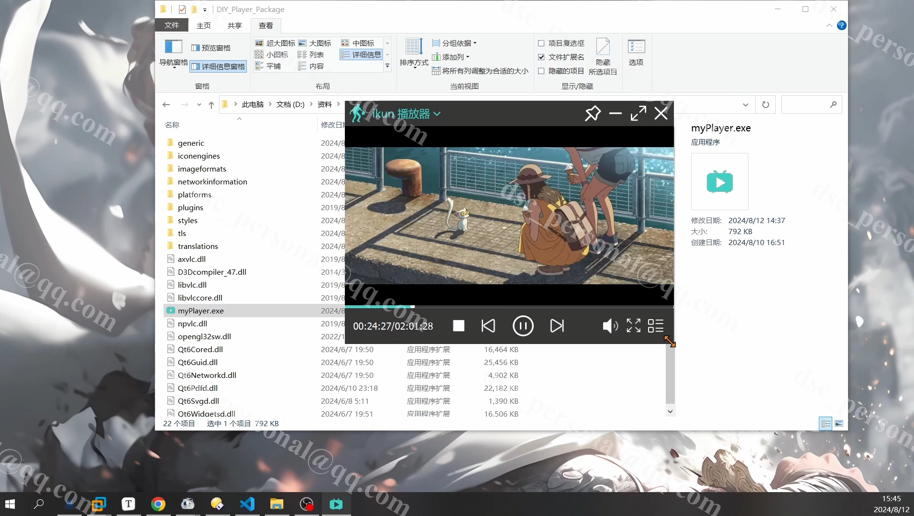
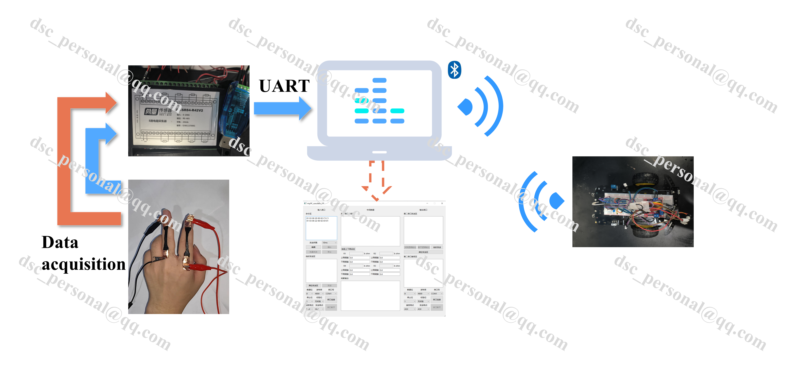

# Representative

- Some videos and pictures are demonstrated
- **E-mail:** dsc_personnal@qq.com

## 跨平台播放器

- 基于**LIBVLC**和**QT**开发的跨平台视频播放器

  - 支持**MP4, AVI, MKV, MOV, FLV, WMV, MPEG, H.264, H.265**等众多主流格式播放

  - 支持缩放、全屏、移动等操作

  - Cmake+QT+LIBVLC开发，支持跨平台，体积轻量

  - 更多细节，**请见视频**

  - <video src="./播放器-win_x264.mp4"></video>

## 远程智能车控制系统（科研项目）

- **实时检测传感器传回来的数据，通过数据处理后以指令的形式转发给无线智能车，智能车能被远程控制**

  - **自研电阻式传感器**，能够精确、低延时地检测大形变（弯曲、拉伸等）信号，具有**低检测限(0.3%)**

  - **上位机构建**：主动问询商用SL-SR84-R42V2采集器数据，将数据解析后判断处理动作然后蓝牙转发给智能车，使用**QSerialPort类**和**多线程**同时处理接受和发送数据，减少数据延时，提高数据有效性

  - 智能车选用STM32F103C8T6作为控制器，用于接受数据和响应指令

  - <video src="./双串口_x264.mp4"></video>

